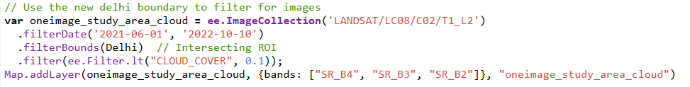
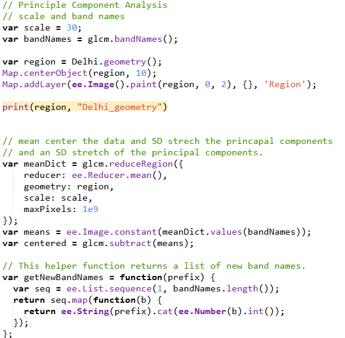
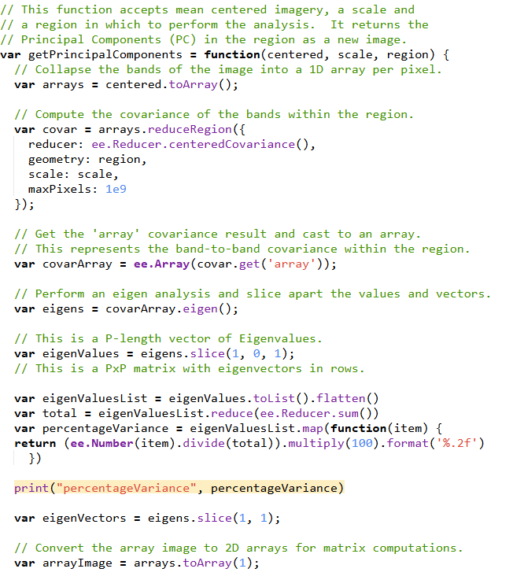
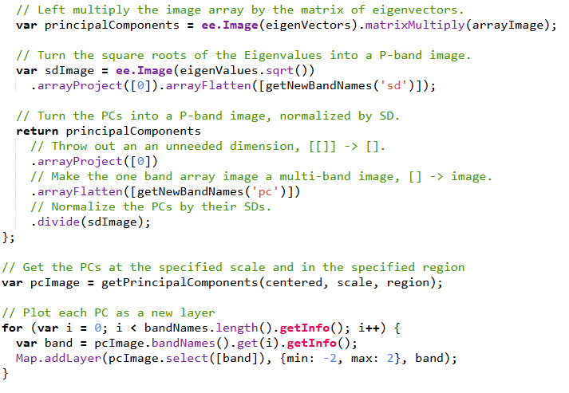

## Introduction to our new RS Interface (GEE & Javascript)

This week's summary will contain more code than previous chapters in reference to what was learned this week.

### What's New

The most significant change from using R studio, ENVI, or SNAP to Google Earth Engine (GEE) is the relationship between the client side and server side of the application. Gone is the requirement to download imagery into my files and upload into an application as GEE holds servers with virtually endless imagery possibility that can be identified and called via client side javascript functions.

As an example this code from the practical searches for a Landsat 8 held within GEE's servers from June 1, 2021 - October 10, 2022 that intersects with the boundary of Delhi, India with a cloud cover of 10% or less. Then it is added to the map window using bands red:4, green:3, and blue:2 (true color). This process makes identifying and accessing remotely sensed data much easier, and in some ways similar to the process of a Google search.

### Utility

Importantly, the practical demonstrated that GEE is capable of completing every task that we have covered previously. Specifically, I felt that the texturing corrections were equally simple to R studio, though PCA seemed much more complicated to run than R studio. Nonetheless, the outputs for both were the same and GEE can handle PCA for much larger areas.

The following code shows the PCA code run in GEE. The code from corrections week in R is much shorter and took noticeably less time to run.

### Any Problems?

Despite the clear benefits of processing time, accessible data, user accessibility, I am concerned by a few traits of Google Earth Engine. Laborious tasks still require time to fully process and load, like the PCA above, and I simply don't have enough experience with GEE to be confident enough in its abilities to speed up a dissertation sized project for example. Additionally, the caveat of Google adding limits to large processing functions further suggests to me the GEE is not a sustainable application to use in a realtively small self guided project without a budget, like a masters thesis.

## Research Capabilities

### **Random Forest Classification**

These papers are not only interesting to me as they pertain to the identification and influence of urban areas, but they also share concepts with our Data Science for Spatial Systems class. In their paper from 2015 (@zhang_development_2020) they develop a random forest machine learning tool to classify the entire world into either impervious or non-impervious areas using GEE engine as the source of training data. In short, (@zhang_development_2020) creates global layers of 37 data points including Landsat surface reflectance, MODIS environmental data, DEM elevation and slope data, etc. This data was then split into a 5° x 5° grid with pixels at 30m spatial resolution. Lastly the random forest classifier was trained and tested in each grid cell individually and a single global binary mosaic output was created at a 95% accuracy.

In contrast to Zhang et al., (@campos-taberner_global_2018) looked to create a global machine learning tool to estimate vegetation qualities and health, specifically: leaf area index, photosynthetic radiation, vegetation cover, and canopy water content. Additionally, their model was trained outside of GEE, but applied with GEE once a global set of MODIS images was attained. In the end, the RF model was able to associate the MODIS attribute data with known PROSAIL (used to train the model) vegetation measures (the variables above) and predict said attributes globally. This resulted in 4 global maps at 500m resolution displaying the four above variables. The leaf area and Photosynthesis map displayed an R2 of 87% and 92% respectively.

To me, the primary methodological takeaway about GEE from these two papers is that GEE provides a more robust combination of tools than either a SNAP/ENVI application and R studio or Python. However, I must note that both studies were at a global scale. It is easy to conceptualize that GEE can outperform R at this scale, but I ask, what if these projects looked at just London or the Yorkshire Dales? Does GEE still provide a notable upgrade? Aside from this, I think the introduction of machine learning in these papers displays that on a theoretical level, there is nothing that one can't do in GEE that one can do in R. With my current knowledge of GEE this tells me that the decision to use GEE is purely one of processing power.

## Thoughts

### If you can't tell... I'm a bit Skeptical.

To be clear, there is much about GEE that I found impressive this week. Certainly the concept of global processing and model training/testing displayed in the papers is exciting. However, I feel that I both overestimated the changes that the client/server system could make to my own current studies and lack sufficient knowledge of GEE methods to be aware of more significant benefits. In chapter 1, I expressed excitement in that I thought GEE could act as a middle ground between SNAP/ENVI and R studio, but after this week I don't think this is the correct verbiage. I think GEE provides an incredibly robust tool for the integration of multidisciplinary methods into RS but with a highlighted, underlined, italicized, bold caveat of <u>***scale***</u>.

Because of this, I have asked myself a few questions this week regarding my potential use of GEE:

**Do I think GEE will be useful for my dissertation?**

-   Probably Not

**Do I think GEE will be useful for the presentation for this class?**

-   Probably Not

**Could I have used GEE for any previous RS projects I did in undergrad?**

-   Yes, but I don't think there would have been an improvement

Despite the generally bleak nature of these responses, this reflects more about me than GEE, that is to say I'm skeptical about my own use of GEE not GEE's overall utility. It's clear that large scale projects benefit greatly from external processing and the ability to integrate client side functionality makes GEE perfect for distributing projects across different platforms. Last term in CASA0013 Ollie gave a guest lecture in which he demonstrated the utility of SQL to process huge data sets incredibly quickly. This alongside what I know some of my friends are studying in CASA0025 suggests to me that GEE serves as a way to bridge both processing power and integrated/interactive display. I'm just not sure about my own use for it at the moment.

## References
