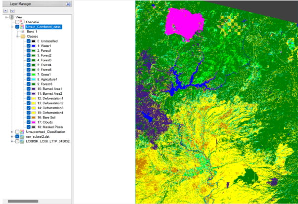
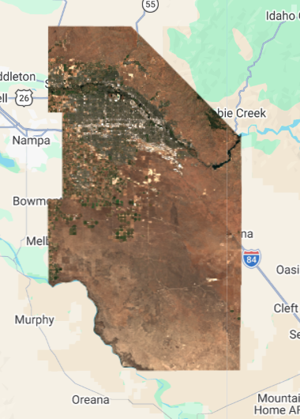
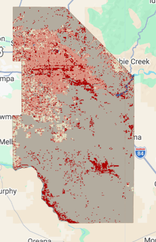

## A Breath of Fresh Air

Last week I expressed some frustration that perhaps Google Earth Engine was not the super tool that I imagined it to be at the start of the term. Although I still hold these general opinions, this week's topic of machine learning classification was somewhat of a welcome surprise. This weeks lecture made me realize that I had previously worked with supervised machine learning before in ENVI, I was simply unaware. During my undergrad R.S class, this process was simply called classification and didn't go into the weeds about the underlying methods. Speaking about regression and random forest as ML toots for classification led me to reread a practical from my previous class, and sure enough, we used training data in ENVI to classify and entire image of Northern California.



### Recent Troubles with Machine Learning

Despite taking the Data Science for Spatial Systems class this term, many machine learning concepts and methods like random forest and neural networks have eluded my abilities of comprehension. Despite this, I feel like I learned more about machine learning from this week's single lecture and practical than the entirety of the DSSS class. I truly enjoyed working with GEE to import data from the server, clip to my county of birth in the USA, and classify its land using a random forest model. For the first time this term, the entire process behind the ML model was clear and understandable.

### Improvements this Week

Specifically using the code below, I was able to produce a classification of Ada County, Idaho, USA with 85% accuracy. I wholy feel that this metric could easily be improves, especially given the output image (also shown below), but that comes down to my own shortcomings in selecting the training data. This brings me to the main challenge of this week's methods. No ML model will ever be perfect, but I was surprised at just how poorly it performed the first go around. I was left with an accuracy around 62%. I went through 5 iterations of the code below each time adding more training data until I felt satisfied with the pattern of growing accuracy. In particular, the model faced great difficulty distinguishing high urban reflectance from desert bare earth reflectance.

```{r, eval=FALSE}
// // --------------------- pixel level --------------------------------

var pixel_number= 1000;

var urban_low_points=ee.FeatureCollection.randomPoints(Urban_low, pixel_number).map(function(i){
  return i.set({'class': 1})})
  
var water_points=ee.FeatureCollection.randomPoints(Water, pixel_number).map(function(i){
  return i.set({'class': 2})})
  
var urban_high_points=ee.FeatureCollection.randomPoints(Urban_high, pixel_number).map(function(i){
  return i.set({'class': 3})})

var grass_points=ee.FeatureCollection.randomPoints(Agg_Forest, pixel_number).map(function(i){
  return i.set({'class': 4})})

var bare_earth_points=ee.FeatureCollection.randomPoints(Desert, pixel_number).map(function(i){
  return i.set({'class': 5})})

// add a random column for test and traning split with values between 0 and 1
var point_sample=ee.FeatureCollection([urban_low_points,
                                  water_points,
                                  urban_high_points,
                                  grass_points,
                                  bare_earth_points])
                                  .flatten()
                                  .randomColumn();

// --------------------- train, test split --------------------------------
                                    
var split=0.7
var training_sample = point_sample.filter(ee.Filter.lt('random', split));
var validation_sample = point_sample.filter(ee.Filter.gte('random', split));

// take samples from image for training and validation  
var training = waytwo_clip.select(bands).sampleRegions({
  collection: training_sample,
  properties: ['class'],
  scale: 10,
});

var validation = waytwo_clip.select(bands).sampleRegions({
  collection: validation_sample,
  properties: ['class'],
  scale: 10
});

// // --------------------- train model --------------------------------

var rf1_pixel = ee.Classifier.smileRandomForest(100)
    .train(training, 'class');

// Get information about the trained classifier.
print('Results of RF trained classifier', rf1_pixel.explain());


// // ---------------------  Conduct classification --------------------------------
    
var rf2_pixel = waytwo_clip.classify(rf1_pixel);

Map.addLayer(rf2_pixel, {min: 1, max: 5, 
  palette: ['d99282', '466b9f', 'ab0000', 'dfdfc2', 'b3ac9f']},
  "RF_pixel");
// // --------------------- Assess Accuracy --------------------------------

var trainAccuracy = rf1_pixel.confusionMatrix();
print('Resubstitution error matrix: ', trainAccuracy);
print('Training overall accuracy: ', trainAccuracy.accuracy());

var validated = validation.classify(rf1_pixel);

var testAccuracy = validated.errorMatrix('class', 'classification');
var consumers=testAccuracy.consumersAccuracy()

print('Validation error matrix: ', testAccuracy);
print('Validation overall accuracy: ', testAccuracy.accuracy())
print('Validation consumer accuracy: ', consumers);

```





## More ML Applications in GEE

Without having looked at the topic for this week, I discussed 2 papers last week that used machine learning in GEE as a segue to help me understand more complex methods possible in GEE. This week, I wanted to look into another feature of Remote Sensing that I have worked with before, the time series.

### Double Time Series

First, (@gao_using_2024) use two separate times series together to measure the erosion dynamics of the extremely fertile black soil region of Northeastern China. Specifically, they use Differential Interferometric Synthetic Aperture Radar (D-InSAR) from 2016-2021 and Small Baseline Subset Interferometric Synthetic Aperture Radar (SBAS-InSAR) from 2017 to create erosion training data for classification of erosion severity. The first time series provides a general change in soil presence while the second time series helps delineate seasonal changes. The model was able to predict erosion patterns to the millimeter and describe regions on mountain sides, near running water, and with sparse vegetation as more susceptible to erosion.

### Vegetation & Temperature

Second, (@aka_toward_2023) use a single time series from 2015-2022 to assess the changes in vegetation and land surface temperature given the introduction of cashew plantations into areas of typically rotation agriculture. They use Sentinel 2 images to classify each image in their collection into either annual crops, perennial crops, bare land, Savannah, or water. Then, Landsat 8 data is used to assess the NDVI and LST of each image to quantify the vegetation and temperature across time. The classification finished with an accuracy of roughly 96% and it shows that temperature increased the most in areas where the perennial cashew plantations replaced bare earth areas.

### So?

These two ML experiments display the utility of temporal changes in classification. Specifically,(@gao_using_2024) displays a combination of a long and short term time series which allows them to highlight both larger patterns of change, and local seasonal changes. However, they fail to describe the accuracy of their model in the same way as (@aka_toward_2023). Simply explaining that the ML model was accurate to a certain range of millimeters could potentially be misleading when the image source is of extremely high spatial resolution. Lastly, one important take I want to highlight is that both of these studies used images available for use within the GEE servers meaning that all of the analysis is by default open source, assuming that one has access to GEE.

## Another Task on the Horizon

Despite the generally positive interactions with both GEE and ML as a concept this week, I can't help but focus on the group presentation assignment coming up. This week was incredibly important for our group as we narrowed down our topic to assessing the growth of informal settlements in floodplains in Manaus, Brazil. Because of this, much of my focus has been on how I/my group could include classification with ML into are project, or if it's necessary. Can ML be used to identify flood threatened areas, informal settlements v. formal developments, or loss of vegetation? Can we use a time series to assess the growth of these communities across time in multiple parts of the city? Even though the project involves coming up with a plan rather than an entire RS analysis, creating a robust potential plan is of high importance to us, and I think classification could be helpful.

Aside from the connections to our project, last week I was fairly critical of the utility of GEE considering I currently don't need large scale processing, the introduction of javascript, etc. But as mentioned in the introduction above, this week was certainly a step up. Given that I recognized my past experience with ML in ENVI, more conceptual practical than some of the code written last week, and the papers using data from the GEE servers, I feel like more of GEE's utility is starting to shine in my mind. Despite this, I still think that I prefer R or Python for my own necessities. I think I could have run a supervised learning classification of Ada County, Idaho just as easily with similar accuracy in R or Python. Connection back to the presentation, we're focusing on open data, and maybe that means focusing on R as an open source tool that won't introduce computation limits in the near future.

## References
