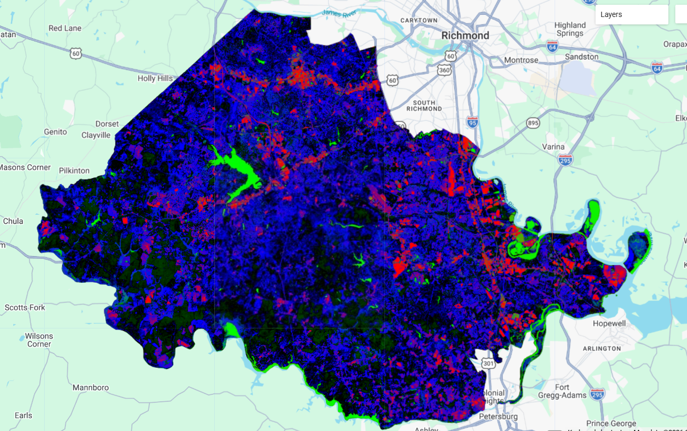
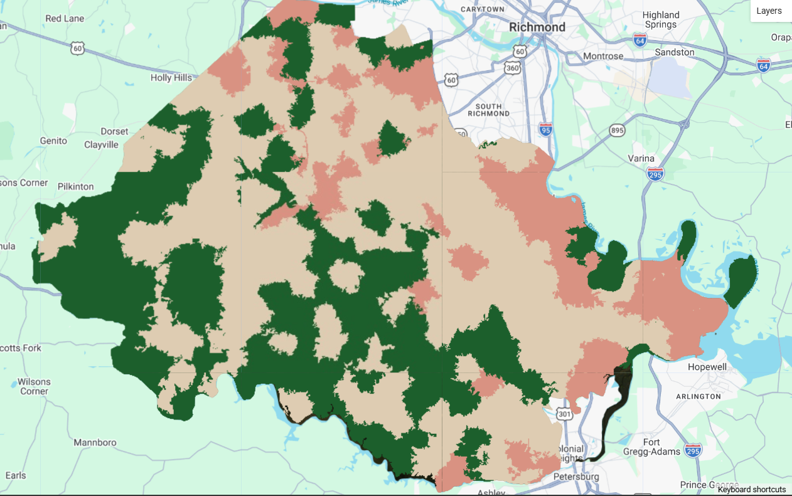

## Classification Pt. 2:

Last week's introduction to CART based classification was very conceptual to me as I had done it before, albeit without realizing. Additionally, using just pixels for the training and test data assisted in its simplicity as each pixel is classified based on the the training information. With this, the addition of sub-pixel and object based classification this week proved to be a bit more of a conceptual challenge for me. Let's run through some of the outputs from the practical and some conclusions I've drawn from the process.

### Sub-Pixel Classification

Sub-pixel classification is most similar to last week. Each pixel receives a class based upon which fraction band exceeds a threshold of presence within each pixel. In this case I created classes for urban, residential, forest, and water environments in Chesterfield, Virginia, USA. Despite the classification broadly capturing the pattern of development, I think my selection of training data was a significant limitation. Residential areas in Chesterfield are covered in trees which made the differentiation between the forest and residential classes difficult. This can be seen in the image below. The southwestern part of Chesterfield is very sparse and forested, yet the classification indicates significant residential areas.

### Object Based Image Analysis (OBIA)

The purpose of classifying with OBIA seemed more difficult to understand while completing the practical, however a few days later it seems relevant for certain purposes (more on that in a bit). After creating objects with the SNIC grid and classifying them entirely, the image below reflects the forested nature of southwestern part of the county better than in the sub-pixel. Though, again issues with the residential/forest mix up are evident this time in the north, and large lake was classified as a forest.

### Takeaways

I ran into the same issue as last week in which the training data failed to accurately distinguish between different classes. Much of this issue is on me as I selected the train data, but this problem helped me understand the utility of the OBIA. Using a cluster of pixels changes the dynamic of the classification from categorizing each individual cell into one of pattern creation. Despite the sub-pixel correctly reflecting detailed land use l in much of Chesterfield County, the grouped nature of the OBIA seems to bypass some of the pitfalls of the training data while still reflecting the general environments of the area.

## Diversity in Classification Purpose

### Micro & Macro Scales

One of the primary takeaways from this week must be that classification is more than a simple delineation of existing properties within an area, there are numerous insights that one can gain from different methods of classification, as mentioned above. This week focused on classification in a micro-scale and a macro-scale which inherently answer different questions.

All imagery regardless of spatial resolution is at heart, a generalization of the land the image captures. The existence of multiple objects of different spectral nature particularly within larger pixels like Landsat means that common analyses like NDVI (or other difference indexes) can suffer from over-generalization as trees in a city can be overshadowed by buildings or roads (@li_extracting_2023). When it becomes relevant to analyze the health of vegetation of residential area growth, mixed pixels, particularly in cities, can significantly conceal meaningful patterns. In the case of (@li_extracting_2023), this meant that Wuhan, China could not accurately ascertain data about its urban vegetation health without the use of sub-pixel NDVI metrics and endmember analysis.

Despite the ability to achieve more fine-grained patterns with sub-pixel classification, there are also times when the researcher, city, organization, etc benefits from a more coarse method of classifications. In a sense, to describe the feeling of a space, not necessarily it's most specific details. OBIA methods excel at identifying significant spectral changes which allow them to group areas together, however, this does lead to misclassifications of individual pixels (@ghorbanzadeh_landslide_2022). For this reason, OBIA methods can be partially calibrated by image segmentation layers to both maintain the benefits of object grouping while taking into account targeted pixel qualities. (@ghorbanzadeh_landslide_2022) used this method to classify areas threatened by landslides in Taiwan by differentiating between fluvial, riparian, and landslide zones which can often have similar spectral qualities.

## We're Really Getting Somewhere Now

Last week's session on classification, though important to lay the foundations, left me with a gap in understanding the potential and purpose of classification. In the reflection I mainly spoke about potential applications in our group presentation and GEE as a whole, rather than the methods I had performed that week. In a sense, I felt as if I was missing the "**WHY**" factor. Okay, great I can see which areas are built up, which areas are neighborhoods, which areas are bare earth, etc, but I could do that with the base RGB image. This week, however, has helped me to fill in that empty "**WHY**" factor. Specifically I want to reflect on 2 simple concepts that I gave a bit more thought to this week.

### Ambiguous Region Classifications

I think one of the reasons I felt so indifferent about classification last week was that in the practical I only classified land cover types that I was familiar with in a place that I was familiar with. I could instantly see the issues or praise the accuracy of the classification once the CART model ran. This took away from the meaning of the classification as, again, I could see the pattern in the RGB image. However, the papers I read this week, and looking back at those from last week display that much of the value of classification comes from categorizing non-obvious land cover differences. Slight changes in NDVI, slope, temperature, or even mineral composition detected by the sensor can distinguish between land covers that a viewer and the RGB image can't do.

### Time Series

Unlike the ambiguous region classifications, I have been aware of the utility of the time series since I took my first RS class in undergrad. However, 3 of the 4 papers I read for the classification sessions involve a time series and analyze changes in classification over time. This has created incredible insight into existing patterns, but more importantly the patterns created are the most valuable piece for informing policy. My group has structured our project of one that looks to provide Manaus, Brazil with a blueprint of potential options based upon where informal settlements are growing. Similarly to the NDVI paper this week, this would require identifying a pattern of change in an ambiguous variable and presenting in an easily understandable way.

## References
