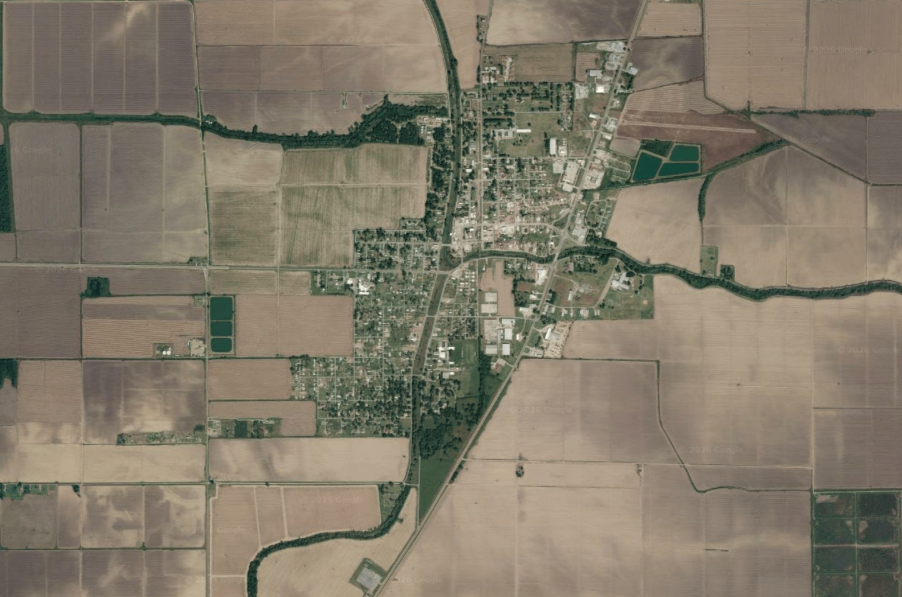
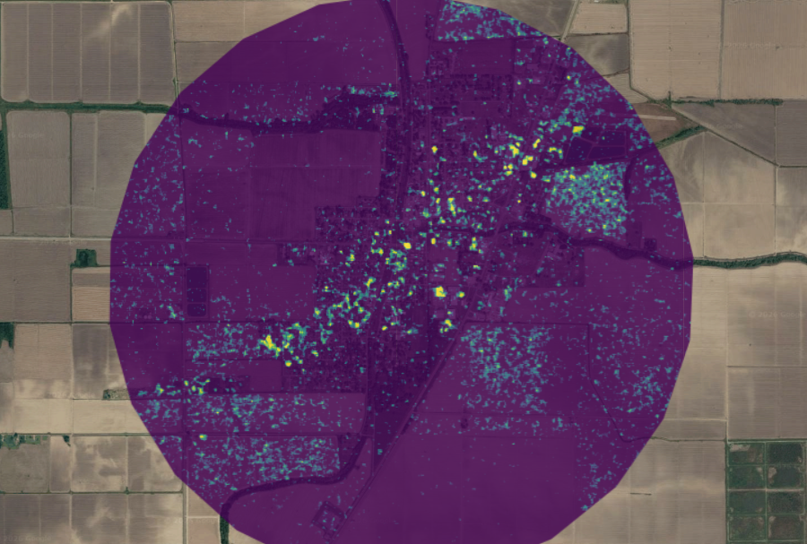

## Synthetic-Aperture Radar (SAR)

This week was quite fun. I enjoyed hopping into Ollie's CASA0025 practical to get a sense of the capabilities of SAR to detect changes in buildings after explosions. He ran through his work in Gaza again and we applied the same (though simplified) techniques to Beirut.

### Not Just Explosions

One of the main points from Ollie, and for that matter by all CASA lecturers I've had, is that any method can be adapted for near endless scenarios; and this practical is a great example. I applied the building damage detection method (briefly outlined below) to Rolling Fork, Mississippi, a Small town that experienced a devastating tornado in March, 2023.

**Brief Summary of Methods**

-   Attain SAR imagery for around 8 months before the disaster and 2 months after

-   Calculate mean and SD pixel values pre and post disaster

-   Run a t-test to determine if and in which pixels significant change (damage) has occurred

-   Print the damage in a defined radius to the GEE map

In the damage image below, the near straight line of damage from SW to NE is consistent with the movement of tornadoes, particularly through a small area like Rolling Fork.

 

### I've Just Struck Gold, But I want Diamonds

Despite the overall good time had in this practical, I felt there were a few tasks from previous practicals that could have made it even better. In the past, a lot of our analysis included clipped images rather than setting a radius. To me is seems more practical for a city, town, county, region, etc to clip the study area to their administrative boundary, particularly if the goal is informing policy which follows said administrative boundary. This may also aid in solving an additional problem I encountered regarding water. In some areas (and I still don't know why) tidal water bodies would appear as great areas of change. This did not occur in Beirut, but did when changing to Lahaina, Hawaii, and Southern Louisiana. I assumed taking the mean and SD of each pixel would avoid this, but regardless the issue persisted. Clipping the study area to just Lahaina would eliminate additional noise created by the tidal changes.

## Additional Utility

### Comparative Analysis

An additional element lacking from the practical is a comparison and/or integration of the SAR band methods with optical imagery methods. Combining the two types of imagery allows for the validation and tuning of the SAR methods given its advantages detecting through clouds (@hamidi_fast_2023). Specifically, a normalized difference flood index can be created with the SAR back scatter data while an optical flooding index can be used to specify the binary flooded/not flooded threshold (@hamidi_fast_2023). This two part dynamic allows both types of imagery to add distinct purpose to the results. SAR maintains is place as the default imagery for the flood detection with a specified threshold as it still functions equally regardless of weather condition, while the optical imagery offers the researcher and additional stakeholders a more conceptual view of the problem given that optical imagery reflects what we see with our eyes. Applying this idea to the examples above may include tuning the damage threshold to avoid extraneous damage information in rural/agricultural fields.

### More Machine Learning and Outside Data Input

While performing classification in GEE, the training data was generated directly from the images themselves; usually creating sample polygons representative of certain classes. However, SAR imagery can be used alongside already known qualities of certain areas. Specifically, binary and manual assessments of road qualities pre and post landslide can be attached as pixel values and then trained in a deep learning model to predict a change in damage of other roads (@karimzadeh_deep_2022). This displays the capability of image analysis to interact with crowdsourced data, further supporting the notion that much remote sensing analysis can be open source and participatory. With this, SAR analysis becomes a particularly valuable tool for policy consulting as Sentinel 1 provides fairly high spatial and temporal resolution, and as seen above, it can be integrated along with additional data sources collected by any given organization (@karimzadeh_deep_2022).

## And Scene... well almost

By now you're well aware of my initial aversion to GEE and subsequent reductions in rancor over the past weeks, and let's just say the ball keeps rolling. This week was a huge step up for my insight into policy, academic, and private industry used for GEE as a whole, but of course SAR data as well. Last week I wrote about the **why** factor of classification and how seeing a few practical applications helped me look at classification beyond a simple description of what's on the ground. In much the same way, though I'd never worked with SAR imagery before, the lecture/practical on SAR coherence seemed immediately powerful for policy advocacy. Perhaps this was clearer because of my work on the final presentation and/or some other lessons I took away from previous week, but I'm certainly warming up to GEE far more than what I expected 3 weeks ago.

### Overall Reflection

That being said, I also want to take some space to reflect on the class and this diary as a whole. This was my third R.S. based class and by a noticeable distance the most in depth and thought provoking (partially due to this very assignment). Despite this, much of the content discussed was at least broadly familiar. What I had not considered in my previous classes were the connections of RS to real world scenarios. With that, the lectures, presentation, and these reflections have forced me to consider the methods taught from outside of the context of the classroom. Luckily I had some experience working with the [Northern Virginia Solar Map](https://www.novasolarmap.com/) but this only used LiDAR data in ArcGIS which felt quite limiting and time consuming as a method of action. Perhaps the greatest takeaway (which applies to other classes as well) has been to consider Occam's razor when proposing a project. I've noticed that many of the papers I've gone through in this assignment support their analysis on only a few difference indexes of textures analyses. Even with the addition of training an ML model, the concepts behind testing vegetation health, land subsidence, or landuse changes remain largely simple. If I had one sentence to advise myself and others in the future, I'd say, "your project only needs to do what it needs to do."
