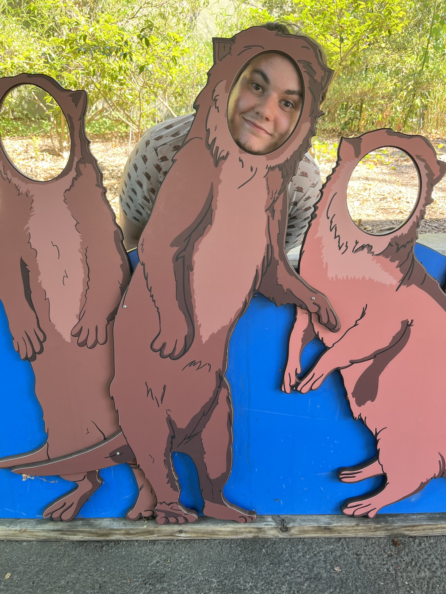

# Background

### A Bit About Me

Hello everyone, I'm Owen Hughes and welcome to my CASA0023: Remote Sensing learning diary. Originally I am from Boise, Idaho, (USA) but I spent most of my time growing up in the suburbs of Richmond, Virginia (USA), both of which will feature in the coming sections of diary. As of 2026 I am 22 years old and I came to CASA as a recent recipient of a BSc in Geography from George Mason University (GMU) in the Northern Virginia suburbs of Washington D.C. (another place that will feature in the diary). I previous took two remote sensing based classes at GMU, one also entitled Remote Sensing taught by [Dr. Konrad Wessels](https://science.gmu.edu/directory/konrad-wessels) and the other entitled Satellite Image Analysis taught by [Dr. Edward Oughton](https://science.gmu.edu/directory/edward-oughton). Within these classes the primary method of analysis was either ENVI or Python so I am excited to explore both R and GEE based image analysis. Outside of the classroom my involvement with remote sensing is less profound, however I was part of team attempting to update the [NOVA (Northern Virginia) Solar Map](https://www.novasolarmap.com/); a tool used to help property owners estimate the potential solar energy output of their roofs in the southwestern D.C. suburbs. This project used LiDAR point cloud data, but unfortunately the bulk of the analysis too place in ArcGIS making the process rather closed off. I draw heavily from these three experiences to provide myself context for the content learned in the following weeks. Without sounding too vague, I want this class to expand upon the content I already know. I've used optical imagery a ton, what about SAR? I've only used LiDAR in ArcGIS, what about in R? I have only calculates simple difference indices, can they become more complex to measure more complex variables?

# Table of Contents

Week 1:

-   [Introduction to Remote Sensing](https://ohughes-2.github.io/Quarto_Diary/Week1.html)

Week 2:

-   [Quarto Books and Xaringan Presentations](https://ohughes-2.github.io/Quarto_Diary/Week2.html)

Week 3:

-   [Corrections and Enhancements](https://ohughes-2.github.io/Quarto_Diary/Week3.html)

Week 4:

-   [Project Case Study: Solar Energy in Loudoun County, Virginia](https://ohughes-2.github.io/Quarto_Diary/Week4.html)

Week 6:

-   [Introduction to Google Earth Engine](https://ohughes-2.github.io/Quarto_Diary/Week5.html)

Week 7:

-   [Remote Sensing and Machine Learning](https://ohughes-2.github.io/Quarto_Diary/Week6.html)

Week 8:

-   [Sub-Pixel and OBIA Classification](https://ohughes-2.github.io/Quarto_Diary/Week7.html)

Week 9:

-   [SAR Damage Detection](https://ohughes-2.github.io/Quarto_Diary/Week8.html)
